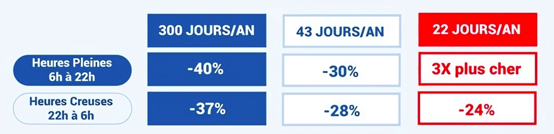
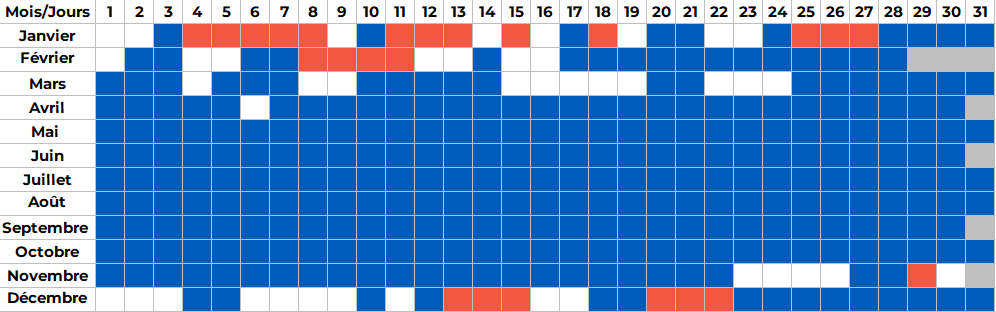

# TEMPO KATA

## *Présentation*
Vous travaillez au sein de Datanumia qui développe des solutions afin de suivre, optimiser et piloter les consommations énergétiques et l’empreinte carbone, que ce soit dans l’habitat individuel ou collectif, les bâtiments tertiaires ou les industries.

Ces solutions permettent aux clients de comparer les données de leur site avec d’autres sites ou foyers similaires, de mesurer les consommations par usages (chauffage, éclairage, etc) et de recevoir des alertes pour réduire leur consommation ou accroître leur performance énergétique.

## *Contexte*

Vous faites partie d’une équipe en charge du développement des API REST fournissant les consommations énergétiques d'un client.

Actuellement, l'offre TEMPO d'EDF n'est pas pris en charge.

En tant qu'utilisateur avec une offre Tempo je souhaite obtenir ma consommation mensuelle au pas jour en €.

## *Comment fonctionne l'offre TEMPO ?*

| 300 jours bleus                                                            | 43 jours blancs                                                            | 22 jours rouges                                                                            |
|:---------------------------------------------------------------------------|:---------------------------------------------------------------------------|:-------------------------------------------------------------------------------------------|
| **En Heures Creuses** : 37% d’économies sur le prix de l’électricité (TTC) | **En Heures Creuses**: 28% d’économies sur le prix de l’électricité (TTC)  | économisez 24% sur le prix de l’électricité (TTC) en Heures Creuses                        |
| **En Heures Pleines** : 40% d’économies sur le prix de l’électricité (TTC) | **En Heures Pleines** : 30% d’économies sur le prix de l’électricité (TTC) | Les jours rouges Tempo sont ceux où le prix du kWh en Heures Pleines est 3 fois plus élevé |

* Le prix de l'électricité est moins cher pendant toute l'année sauf pendant les heures pleines des jours rouges.
* Chaque saison, entre le 1er novembre et le 31 mars, sont répartis 22 jours rouges où le prix de l'électricité est 3 fois plus cher pendant les heures pleines !!

